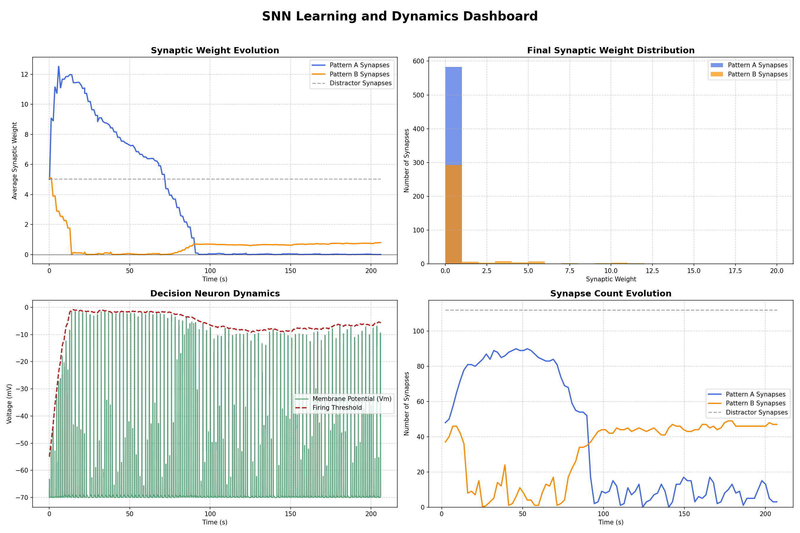

# DynamicSNN: A High-Performance C++ Simulator for Biologically-Inspired Learning

[](https://isocpp.org/std/the-standard)
[](https://opensource.org/licenses/MIT)

**DynamicSNN** is a high-performance C++ simulator designed to explore the frontiers of biologically-plausible learning in Spiking Neural Networks (SNNs). It uniquely models the **synergistic interplay of three powerful plasticity mechanisms**, enabling networks to learn, unlearn, and adapt with remarkable cognitive flexibility.

This simulator moves beyond single-mechanism models by integrating:

> ### 🧠 Reward-Modulated STDP
> A three-factor learning rule where synaptic changes are guided by a global dopamine signal, reinforcing or discouraging connections based on task performance (reward/punishment).

> ### 🔗 Structural Plasticity
> The network dynamically rewires itself by pruning weak connections and sprouting new ones, efficiently discovering novel pathways to solve a task.

> ### ⚖️ Homeostatic Plasticity
> Neurons self-regulate their firing thresholds to maintain stable activity, preventing runaway excitation or quiescence and promoting an efficient, balanced network.

This multi-faceted approach is demonstrated in a challenging "Go/No-Go" task reversal, proving that the network can successfully learn, unlearn, and relearn task rules as its environment changes.

## Visualizing the Network's Evolution

The simulation generates a detailed log file that can be visualized with the provided Python script. The dashboard below showcases the network's performance, synaptic weight changes, structural modifications (pruning/sprouting), and neuronal adaptation throughout the experiment.



In the dashboard, you can observe how the network:
1.  **Learns the initial task:** It grows connections from "Pattern A" neurons (sprouting), strengthens them (LTP), and simultaneously weakens and removes connections from "Pattern B" neurons (LTD & pruning).
2.  **Adapts to the reversal:** It aggressively prunes the now-incorrect "A" synapses while rapidly forming and strengthening new "B" synapses to master the new rule.
3.  **Achieves efficiency:** Homeostasis ensures that only the necessary B synapses are potentiated (the vast majority remain depressed) once reversal starts, creating a sparse and efficient final network, which is ideal for efficent deployment.
4. **Spiking nature:** You can see the voltage of the decision neuron spiking up and down, and it's firing threshold increasing due to homeostatsic mechanisms ensuring network efficiency.

## The Core Experiment: Cognitive Flexibility

The project's benchmark is a classic **Go/No-Go task reversal** designed to test the network's adaptability.

1.  **Phase 1: Initial Learning (0s - 90s)**
    -   **Goal:** Learn to fire for "Pattern A" (Go), but not for "Pattern B" (No-Go).
    -   **Reward:** Given for firing in response to Pattern A.
    -   **Punishment:** Given for firing in response to Pattern B.

2.  **Phase 2: Task Reversal (90s - 210s)**
    -   **Goal:** Unlearn the old rule and learn the new one: fire for "B", not for "A".
    -   **Reward:** The contingencies are flipped. Now given for firing for Pattern B.
    -   **Punishment:** Now given for firing for Pattern A.

This experiment validates that the synergy between the three plasticity rules enables the network to not only learn an initial task but also to flexibly adapt when the environment's rules are inverted.

## Key Features

-   **Flexible Neuron Models:** Choose between the classic Leaky Integrate-and-Fire (LIF) or the more biologically-complex Izhikevich model to suit your experiment's needs.
-   **Synergistic Plasticity:** The first-class integration of Reward-Modulated STDP, Structural Plasticity, and Homeostatic Plasticity in a single, cohesive simulation.
-   **High-Performance & Parallelized:** The core simulation loop is parallelized with **OpenMP** to leverage multi-core processors for rapid experimentation.
-   **Fully Configurable:** Tweak nearly every parameter—from neuron physics to learning rates and experiment structure—in a single `config.json` file, no recompilation needed.
-   **Rich Data Logging & Visualization:** Generate a comprehensive `simulation_log.csv` and use the provided `visualise.py` script to create a detailed dashboard of your experiment's results.

## Getting Started

### Prerequisites

-   A C++17 compatible compiler (e.g., GCC, Clang, MSVC)
-   CMake (version 3.15 or later)
-   OpenMP (usually included with modern compilers)
-   **For visualization:** Python 3 with `pandas`, `numpy`, and `matplotlib`.

### Installation & Execution

Follow these steps from your terminal in the project's root directory.

**1. Clone the repository and download dependencies:**
```bash
git clone https://github.com/your-username/DynamicSNN.git
cd DynamicSNN
chmod +x get_json.sh && ./get_json.sh
```
> _**Note:** The `get_json.sh` script downloads the `nlohmann/json` library, which is required for handling the `config.json` file._

**2. Build the simulator:**
```bash
mkdir build
cd build
cmake ..
make -j
```
This creates an executable named `SNN_Project` inside the `build` directory.

**3. Run the simulation:**
Navigate back to the root directory and run the executable.
```bash
cd ..
./build/SNN_Project
```
The simulation will print its progress. Upon completion, it will generate a `simulation_log.csv` file in the root directory.

**4. Visualize the results:**
First, install the required Python libraries:
```bash
pip install pandas matplotlib numpy
```
Then, run the visualization script:
```bash
python visualise.py
```
This will generate `simulation_dashboard.png` and open a plot window.

## Customization

Easily modify the experiment by editing the `config.json` file. You can disable plasticity mechanisms, change learning rates, adjust neuron counts, define the experiment timeline, and much more. The simulator loads this configuration on every run.

## Project Motivation

This project was born out of a fascination with structural neuroplasticity, first encountered in a high school psychology class ([VCE Psychology](https://www.vcaa.vic.edu.au/curriculum/vce-curriculum/vce-study-designs/psychology/vce-psychology)). The goal was to build a computational testbed from the ground up to explore how the brain's ability to rewire itself could work in concert with other known forms of learning.

## Project Structure

The codebase is organized into modular components for clarity and extensibility:

-   `main.cpp`: Entry point; loads configuration and launches the experiment.
-   `experiment.h/.cpp`: Defines the high-level experimental protocol (Go/No-Go task).
-   `network.h/.cpp`: The core SNN engine, managing neurons, synapses, and plasticity.
-   `neuron.h/.cpp`: Implements the LIF and Izhikevich neuron models.
-   `synapse.h/.cpp`: Defines the synapse model, including short-term plasticity (STP).
-   `learning_rules.h/.cpp`: Contains the logic for R-STDP, structural, and homeostatic plasticity.
-   `config.h/.cpp`: Handles loading parameters from the `config.json` file.
-   `datalogger.h/.cpp`: Manages efficient, buffered logging of simulation data.
-   `visualise.py`: Python script to parse the log file and generate the results dashboard.
-   `CMakeLists.txt`: The build script for CMake.

## Roadmap

This project is an ongoing exploration. Future plans include:
-   [ ] Implementing additional neuron and synapse models.
-   [ ] Exploring more advanced forms of structural or homeostatic plasticity.
-   [ ] Adding support for more complex, time-varying input signals.
-   [ ] Creating Python bindings for easier integration with data science toolkits.

## Contributing

Contributions are welcome! If you have ideas for new features, find a bug, or want to improve the documentation, please feel free to open an issue or submit a pull request.

## License

This project is licensed under the MIT License. See the `LICENSE` file for details.
